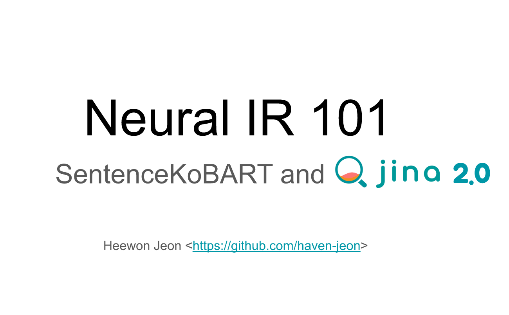

<!-- vscode-markdown-toc -->
* 1. [Setup](#Setup)
* 2. [Approximate KNN Search with AnnLite](#ApproximateKNNSearchwithAnnLitehttps:github.comjina-aiannlite)
	* 2.1. [Index](#Index)
	* 2.2. [Query](#Query)
		* 2.2.1. [Retrieval Augmented Response with OpenAI ChatGPT](#RetrievalAugmentedResponsewithOpenAIChatGPT)
* 3. [Presentation](#Presentation)
* 4. [Demo](#Demo)
* 5. [Links](#Links)
* 6. [FAQ](#FAQ)
	* 6.1. [Why this dataset?](#Whythisdataset)
	* 6.2. [LFS quota is exceeded](#LFSquotaisexceeded)
* 7. [Citation](#Citation)
* 8. [License](#License)

<!-- vscode-markdown-toc-config
	numbering=true
	autoSave=true
	/vscode-markdown-toc-config -->
<!-- /vscode-markdown-toc -->


# LegalQA using SentenceKoBART and OpenAI ChatGPT

Implementation of legal QA system based on Sentence[KoBART](https://github.com/SKT-AI/KoBART)

- [How to train SentenceKoBART](SentenceKoBART)
- Based on Neural Search Engine [Jina](https://github.com/jina-ai/jina) v2.0
- [Provide Korean legal QA data](data/legalqa.jsonlines)(1,830 pairs)
- [Apply approximate KNN search](#approximate-knn-search) with [Faiss](https://github.com/facebookresearch/faiss), [Annoy](https://github.com/spotify/annoy), [Hnswlib](https://github.com/nmslib/hnswlib).
- Retrieval Augmented Answer Generation with [OpenAI ChatGPT](https://openai.com/blog/chatgpt).


##  1. <a name='Setup'></a>Setup

```bash
# install git lfs , https://github.com/git-lfs/git-lfs/wiki/Installation
curl -s https://packagecloud.io/install/repositories/github/git-lfs/script.deb.sh | sudo bash
sudo apt install git-lfs
git clone https://github.com/haven-jeon/LegalQA.git
cd LegalQA
git lfs pull
# If the lfs quota is exceeded, please download it with the command below.
# https://drive.google.com/file/d/1DJFMknxT7OAAWYFV_WGW2UcCxmuf3cp_/view?usp=sharing
# mv SentenceKoBART.bin model/
# pip install --use-deprecated=legacy-resolver  -r requirements.txt 
pip install -r requirements.txt
```


##  2. <a name='ApproximateKNNSearchwithAnnLitehttps:github.comjina-aiannlite'></a>Approximate KNN Search with [AnnLite](https://github.com/jina-ai/annlite)

###  2.1. <a name='Index'></a>Index

```sh
python app.py -t index --flow flows/index_annlite.yml
```


GPU-based indexing available as an option

- device: cuda

###  2.2. <a name='Query'></a>Query

```sh
# test on bash
python app.py -t query --flow flows/query_annlite.yml
# test on REST API
python app.py -t query_restful --flow flows/query_annlite.yml
```


####  2.2.1. <a name='RetrievalAugmentedResponsewithOpenAIChatGPT'></a>Retrieval Augmented Response with OpenAI ChatGPT

- Get OpenAI API from https://platform.openai.com/account/api-keys

```sh
OPENAI_API_KEY=$OPENAI_KEY python app.py -t query --flow flows/query_annlite_openai.yml
```




##  3. <a name='Presentation'></a>Presentation

- [Neural IR 101](http://tiny.one/neuralIR101)

| |
| ------ |

##  4. <a name='Demo'></a>Demo 

- Working!

| |
| ------ |

##  5. <a name='Links'></a>Links

- [[AI 모델 탐험기] #13 Neural Search를 이용하여 제작된 법률 QA 검색 시스템, Legal QA](https://medium.com/ai-networkkr/ai-%EB%AA%A8%EB%8D%B8-%ED%83%90%ED%97%98%EA%B8%B0-13-neural-search%EB%A5%BC-%EC%9D%B4%EC%9A%A9%ED%95%98%EC%97%AC-%EC%A0%9C%EC%9E%91%EB%90%9C-%EB%B2%95%EB%A5%A0-qa-%EA%B2%80%EC%83%89-%EC%8B%9C%EC%8A%A4%ED%85%9C-legal-qa-a0a6a1eb35bf)

##  6. <a name='FAQ'></a>FAQ

###  6.1. <a name='Whythisdataset'></a>Why this dataset?

Legal data is composed of technical terms, so it is difficult to search if you are not familiar with these terms. Because of these characteristics, I thought it was a good example to show the effectiveness of neural IR.

###  6.2. <a name='LFSquotaisexceeded'></a>LFS quota is exceeded

You can download `SentenceKoBART.bin` from one of the two links below.

- https://drive.google.com/file/d/1DJFMknxT7OAAWYFV_WGW2UcCxmuf3cp_/view?usp=sharing

##  7. <a name='Citation'></a>Citation

Model training, data crawling, and demo system were all supported by the **AWS Hero** program.

```
@misc{heewon2021,
author = {Heewon Jeon},
title = {LegalQA using SentenceKoBART},
publisher = {GitHub},
journal = {GitHub repository},
howpublished = {\url{https://github.com/haven-jeon/LegalQA}}
```


##  8. <a name='License'></a>License

- QA data `data/legalqa.jsonlines` is crawled in [www.freelawfirm.co.kr](http://www.freelawfirm.co.kr/lawqnainfo) based on `robots.txt`. Commercial use other than academic use is prohibited.
- We are not responsible for any legal decisions we make based on the resources provided here.
