# LegalQA using SentenceKoBART

SentenceKoBART 모델을 기반으로 하는 법률 QA 시스템 구현

- [How to train SentenceKoBART](pods/README.md)
- Neural Search Engine [Jina](https://github.com/jina-ai/jina) 활용
- 법률 QA 데이터 수집(1,830 pairs)


## Setup

```bash
git clone https://github.com/haven-jeon/LegalQA.git
cd LegalQA
sh get_model.sh
pip install -r requirements.txt
```

## Index


```sh
python app.py -t index
```



`pods/encoder.yml` - `on_gpu: true` 옵션으로 GPU 기반 인덱싱 가능 

## Search

### With REST API

To start the Jina server for REST API:

```sh
python app.py -t query_restful
```


Then use a client to query:

```sh
curl --request POST -d '{"top_k": 1, "mode": "search",  "data": ["상속 관련 문의"]}' -H 'Content-Type: application/json' 'http://0.0.0.0:1234/api/search'
````

Or use [Jinabox](https://jina.ai/jinabox.js/) with endpoint `http://127.0.0.1:1234/api/search`

### From the terminal

```sh
python app.py -t query
```

## Demo 

- http://ec2-3-36-123-253.ap-northeast-2.compute.amazonaws.com:7874/

| |
| ------ |


## Citation

Model training, data crawling, and demo system were all supported by the **AWS Hero** program.

```
@misc{heewon2021,
author = {Heewon Jeon},
title = {LegalQA using SentenceKoBART},
publisher = {GitHub},
journal = {GitHub repository},
howpublished = {\url{https://github.com/haven-jeon/LegalQA}}
```


## License

- QA 데이터인 `data/legalqa.jsonlines`는 [www.freelawfirm.co.kr](http://www.freelawfirm.co.kr/lawqnainfo)에서 `robots.txt`에 준거하여 크롤링한 데이터이며 학술적인 용도 이외에 상업적인 이용은 할 수 없습니다.(`CC BY-NC-SA 4.0`)
- 이곳에서 제공하는 리소스를 활용해 법률적 판단을 하는것에 대해서 어떠한 책임도 지지 않습니다.
