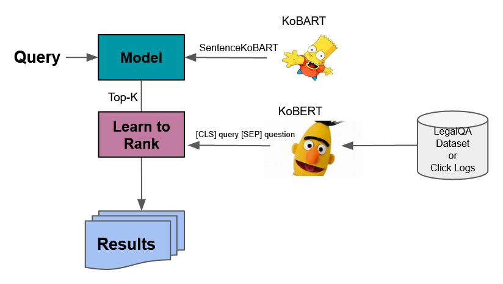

<!-- @import "[TOC]" {cmd="toc" depthFrom=1 depthTo=6 orderedList=false} -->

<!-- code_chunk_output -->

- [LegalQA using SentenceKoBART](#legalqa-using-sentencekobart)
  - [Setup](#setup)
  - [Index](#index)
  - [Train](#train)
    - [Learn to Rank with KoBERT](#learn-to-rank-with-koberthttpsgithubcomsktbrainkobert)
  - [Search](#search)
    - [With REST API](#with-rest-api)
    - [From the terminal](#from-the-terminal)
      - [Approximate KNN Search](#approximate-knn-search)
  - [Presentation](#presentation)
  - [Demo](#demo)
  - [Links](#links)
  - [FAQ](#faq)
    - [Why this dataset?](#why-this-dataset)
    - [LFS quota is exceeded](#lfs-quota-is-exceeded)
  - [Citation](#citation)
  - [License](#license)

<!-- @import "[TOC]" {cmd="toc" depthFrom=1 depthTo=6 orderedList=false} -->

<!-- /code_chunk_output -->


# LegalQA using SentenceKoBART

Implementation of legal QA system based on Sentence[KoBART](https://github.com/SKT-AI/KoBART)

- [How to train SentenceKoBART](SentenceKoBART)
- Based on Neural Search Engine [Jina](https://github.com/jina-ai/jina) v2.0
- [Provide Korean legal QA data](data/legalqa.jsonlines)(1,830 pairs)
- [Apply approximate KNN search](#approximate-knn-search) with [Faiss](https://github.com/facebookresearch/faiss), [Annoy](https://github.com/spotify/annoy), [Hnswlib](https://github.com/nmslib/hnswlib).


## Setup

```bash
# install git lfs , https://github.com/git-lfs/git-lfs/wiki/Installation
curl -s https://packagecloud.io/install/repositories/github/git-lfs/script.deb.sh | sudo bash
sudo apt install git-lfs
git clone https://github.com/haven-jeon/LegalQA.git
cd LegalQA
git lfs pull
# If the lfs quota is exceeded, please download it with the command below.
# wget http://gogamza.ipdisk.co.kr:80/gogamzapubs/VOL1/URLs/models/SentenceKoBART.bin
# mv SentenceKoBART.bin model/
pip install -r requirements.txt
```

## Index


```sh
python app.py -t index
```


GPU-based indexing available as an option

- `pods/encode.yml` - `device: cuda`

## Train

The SentenceKoBART is not a model tuned based on the legal task, so it guarantees good recall, but requires adjustment in terms of precision. By re-ranking the results of top-k using a cross-encoder, we can supplement in terms of precision.



- Model : Ranking for general purpose
- Learn to Rank : Ranking for task specific purpose

### Learn to Rank with [KoBERT](https://github.com/SKTBrain/KoBERT)

Initial training is done by classifying whether the **title** of the dataset and the **question** are related pairs like below.

Why BERT?

- To use BERT NSP power.

> [CLS] title [SEP] question [SEP]

| title  |  question | label | 
|---|---|----|
| 오토바이의 고속도로 주행금지가 행복추구권 등을 침해한 것은 아닌지 여부  | 甲은 평소 오토바이를 좋아하여 주말, 휴일이면 오토바이로 전국을 여행하였습니다. 그런데 ...  | positive |
| 피해자과실로 인한 교통사고로 개인택시사업면허가 취소된 경우  | 甲은 평소 오토바이를 좋아하여 주말, 휴일이면 오토바이로 전국을 여행하였습니다. 그런데 ...  | negative |

```bash
python app.py -t train
```


The trained model is saved in the `rerank_model` directory.

We provide a KoBERT model tuned with LegalQA([gogamza/kobert-legalqa-v1](https://huggingface.co/gogamza/kobert-legalqa-v1)).


## Search

### With REST API

To start the Jina server for REST API:

```sh
# python app.py -t query_restful --query_flow flows/query_numpy_rerank.yml
python app.py -t query_restful 
```



Then use a client to query:

```sh
curl --request POST -d '{"parameters": {"top_k": 1},  "data": ["상속 관련 문의"]}' -H 'Content-Type: application/json' 'http://0.0.0.0:1234/search'
````

Or use [Jinabox](https://jina.ai/jinabox.js/) with endpoint `http://127.0.0.1:1234/search`


### From the terminal

```sh
# python app.py -t query --query_flow flows/query_numpy_rerank.yml
python app.py -t query
```

#### Approximate KNN Search

```sh
python app.py -t query_restful --query_flow flows/query_hnswlib_rerank.yml
```


```sh
python app.py -t query_restful --query_flow flows/query_faiss_rerank.yml
```


```sh
python app.py -t query_restful --query_flow flows/query_annoy_rerank.yml
```


- **Retrieval time**(sec.)
  - AMD Ryzen 5 PRO 4650U, 16 GB Memory
  - Average of 100 searches
  - Excluding BertReRanker

| top-k |  Numpy |  Hnswlib |  Faiss  |  Annoy | 
|:-----:|:------:|:----:|:-----:|:-----:|
|   10  |   1.433 |  0.101  |  0.131 |  0.118  |


## Presentation

- [Neural IR 101](http://tiny.one/neuralIR101)

| |
| ------ |

## Demo 

- [To Demo](http://ec2-3-36-123-253.ap-northeast-2.compute.amazonaws.com:7874/)

| |
| ------ |

## Links

- [[AI 모델 탐험기] #13 Neural Search를 이용하여 제작된 법률 QA 검색 시스템, Legal QA](https://medium.com/ai-networkkr/ai-%EB%AA%A8%EB%8D%B8-%ED%83%90%ED%97%98%EA%B8%B0-13-neural-search%EB%A5%BC-%EC%9D%B4%EC%9A%A9%ED%95%98%EC%97%AC-%EC%A0%9C%EC%9E%91%EB%90%9C-%EB%B2%95%EB%A5%A0-qa-%EA%B2%80%EC%83%89-%EC%8B%9C%EC%8A%A4%ED%85%9C-legal-qa-a0a6a1eb35bf)

## FAQ

### Why this dataset?

Legal data is composed of technical terms, so it is difficult to search if you are not familiar with these terms. Because of these characteristics, I thought it was a good example to show the effectiveness of neural IR.

### LFS quota is exceeded

You can download `SentenceKoBART.bin` from one of the two links below.

- http://gogamza.ipdisk.co.kr:80/gogamzapubs/VOL1/URLs/models/SentenceKoBART.bin
- https://komodels.s3.ap-northeast-2.amazonaws.com/models/SentenceKoBART.bin

## Citation

Model training, data crawling, and demo system were all supported by the **AWS Hero** program.

```
@misc{heewon2021,
author = {Heewon Jeon},
title = {LegalQA using SentenceKoBART},
publisher = {GitHub},
journal = {GitHub repository},
howpublished = {\url{https://github.com/haven-jeon/LegalQA}}
```


## License

- QA data `data/legalqa.jsonlines` is crawled in [www.freelawfirm.co.kr](http://www.freelawfirm.co.kr/lawqnainfo) based on `robots.txt`. Commercial use other than academic use is prohibited.
- We are not responsible for any legal decisions we make based on the resources provided here.
