# LegalQA using SentenceKoBART

Implementation of legal QA system based on Sentence[KoBART](https://github.com/SKT-AI/KoBART)

- [How to train SentenceKoBART](pods/README.md)
- Based on Neural Search Engine [Jina](https://github.com/jina-ai/jina) 
- [Provide Korean legal QA data](data/legalqa.jsonlines)(1,830 pairs)


## Setup

```bash
# install git lfs , https://github.com/git-lfs/git-lfs/wiki/Installation
curl -s https://packagecloud.io/install/repositories/github/git-lfs/script.deb.sh | sudo bash
sudo apt install git-lfs
git clone https://github.com/haven-jeon/LegalQA.git
cd LegalQA
git lfs pull
# If the lfs quota is exceeded, please download it with the command below.
# wget https://komodels.s3.ap-northeast-2.amazonaws.com/models/SentenceKoBART.bin
# mv SentenceKoBART.bin model/
pip install -r requirements.txt
```

## Index


```sh
python app.py -t index
```



GPU-based indexing available as an option

- `pods/encoder.yml` - `on_gpu: true`

## Search

### With REST API

To start the Jina server for REST API:

```sh
python app.py -t query_restful
```



Then use a client to query:

```sh
curl --request POST -d '{"top_k": 1, "mode": "search",  "data": ["상속 관련 문의"]}' -H 'Content-Type: application/json' 'http://0.0.0.0:1234/api/search'
````

Or use [Jinabox](https://jina.ai/jinabox.js/) with endpoint `http://127.0.0.1:1234/api/search`

### From the terminal

```sh
python app.py -t query
```

## Demo 

- http://ec2-3-36-123-253.ap-northeast-2.compute.amazonaws.com:7874/

| |
| ------ |


## Citation

Model training, data crawling, and demo system were all supported by the **AWS Hero** program.

```
@misc{heewon2021,
author = {Heewon Jeon},
title = {LegalQA using SentenceKoBART},
publisher = {GitHub},
journal = {GitHub repository},
howpublished = {\url{https://github.com/haven-jeon/LegalQA}}
```


## License

- QA data `data/legalqa.jsonlines` is crawled in [www.freelawfirm.co.kr](http://www.freelawfirm.co.kr/lawqnainfo) based on `robots.txt`. Commercial use other than academic use is prohibited.
- We are not responsible for any legal decisions we make based on the resources provided here.
