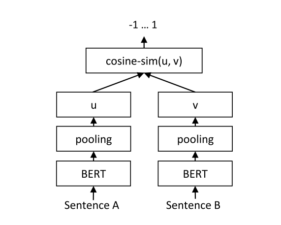

# SentenceKoBART



[Sentence-BERT: Sentence Embeddings using Siamese BERT-Networks](https://arxiv.org/abs/1908.10084) 논문에서 아이디어 착안, BART의 인코더 성능을 활용한다. 

### Dataset

- [KorSTS](https://github.com/kakaobrain/KorNLUDatasets)
  - Train : 17,373
  - Test : 2,867
- [KLUE](https://github.com/KLUE-benchmark/KLUE) STS Dataset
  - Train : 11,668
  - Test : 10

### Hwo to train

```
python sentencekobart.py --gpus 1 --max_epochs 20 --default_root_dir training_log --gradient_clip_val 1.0  --train_file sts_train.tsv --test_file sts_test.tsv --batch_size 64 --avg_type norm_avg --subtask STS
```

### Performance

| Dataset  | Pearson corr. | Spearman corr.  |
|:--------:|:-------------:|:---------------:|
| KorSTS(test) + KLUE STS(test) | 0.82  |   0.83  |

